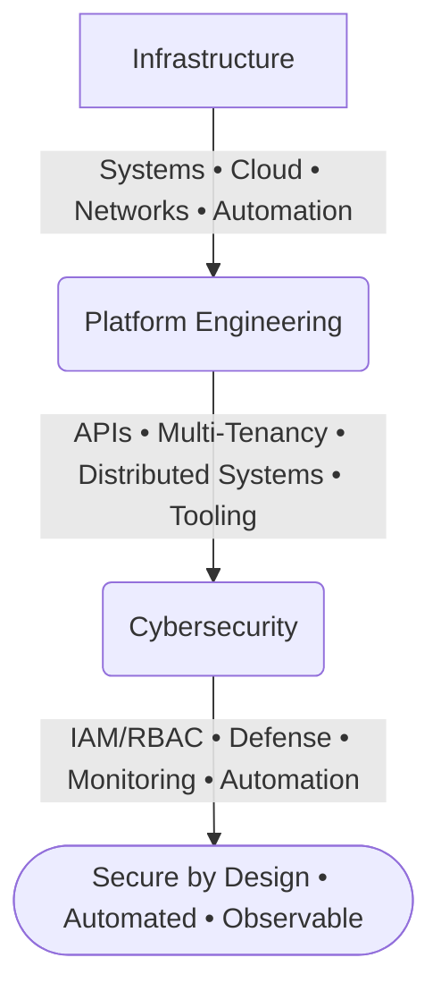

# CALEB NGENO

### Infrastructure • Cybersecurity • Cloud • Automation • Platform Engineering

**Designing secure infrastructure and engineering platforms for modern operations.**

---

## Profile

Engineering secure, resilient, and scalable technology platforms across infrastructure, cybersecurity, cloud, automation, and enterprise software.

My work combines systems engineering, security architecture, platform development, and operational automation to transform complex technology requirements into reliable, maintainable systems.

> **Engineering Philosophy:** *Secure by design. Automated by default. Observable in operation. Built to scale.*

---

## Core Capabilities

| **Infrastructure**              | **Cybersecurity**           | **Cloud & Platform**   | **DevOps & Automation**    |
| ------------------------------- | --------------------------- | ---------------------- | -------------------------- |
| Windows & Linux Environments    | Network Security & Defense  | Cloud Architecture     | Infrastructure Automation  |
| Active Directory & GPO          | Threat Detection & Analysis | Multi-Tenant Systems   | Bash, PowerShell, Python   |
| DNS / DHCP Administration       | Vulnerability Assessment    | SaaS Architecture      | CI/CD Deployment Workflows |
| Server & Network Infrastructure | IAM, RBAC & Monitoring      | REST APIs & Containers | Logging & Observability    |

---

# Selected Engineering Work

The following repositories represent my primary engineering focus and demonstrate work across **platform engineering, infrastructure automation, cybersecurity, networking, and security tooling**.

### 01 — [iaas-platform](https://github.com/ogc16/iaas-platform) | Infrastructure-as-a-Service Platform

A Go-based infrastructure platform designed around multi-tenant resource management and programmable compute resources.

* **Architecture:** Multi-Tenant Organizations, Resource Management, API Authentication, Rate Limiting, Usage-Based Billing
* **Tech Stack:** Go, REST APIs, Cloud Architecture, SaaS

---

### 02 — [autorun](https://github.com/ogc16/autorun) | Centralized IT Automation Platform

A controlled automation platform for executing and scheduling operational workloads across IT environments with access control, auditing, and operational visibility.

* **Capabilities:** Bash / Python / PowerShell execution, job scheduling, live execution logs, RBAC, audit trails, and alerts
* **Tech Stack:** Java 17, Spring Boot, RBAC, PowerShell, Python, Bash

---

### 03 — [nids](https://github.com/ogc16/nids) | Network Intrusion Detection & Security Operations

An open-source cybersecurity platform focused on network monitoring, deep packet analysis, protocol inspection, and security operations workflows.

* **Capabilities:** Network monitoring, packet analysis, protocol analysis, security playbooks, and network capture
* **Tech Stack:** TypeScript, Wireshark, Tshark, Npcap, Network Security

---

### 04 — [cyber-shield-up](https://github.com/ogc16/cyber-shield-up) | AI-Assisted Security Tooling

A security-focused browser extension exploring automated vulnerability detection and AI-assisted security analysis.

* **Capabilities:** Browser-based security analysis, vulnerability scanning, and AI-assisted assessment
* **Tech Stack:** TypeScript, Chrome Extensions, AI, Security

---

### 05 — [VPN](https://github.com/ogc16/VPN) | Secure Network Tunneling

A WireGuard-based networking project focused on secure tunneling, network forwarding, and secure connectivity.

* **Capabilities:** Tunnel architecture, WireGuard integration, network forwarding, and secure connectivity
* **Tech Stack:** Kotlin, WireGuard, Networking

---

# Business & Enterprise Systems

A curated selection of application platforms demonstrating experience translating business and operational requirements into software systems.

| **Project**                                               | **Domain**                            | **Technology**  |
| --------------------------------------------------------- | ------------------------------------- | --------------- |
| [pbooks](https://github.com/ogc16/pbooks)                 | Construction Operations & Bookkeeping | TypeScript      |
| [booksy](https://github.com/ogc16/booksy)                 | Bookkeeping SaaS                      | TypeScript      |
| [aggregatorX](https://github.com/ogc16/aggregatorX)       | Data Aggregation Platform             | React / Node.js |
| [fina](https://github.com/ogc16/fina)                     | Financial Management                  | TypeScript      |
| [lms](https://github.com/ogc16/lms)                       | Learning Management                   | Python / Django |
| [swiftinvoice](https://github.com/ogc16/swiftinvoice)     | Invoicing Platform                    | Swift           |
| [restaurant-pos](https://github.com/ogc16/restaurant-pos) | Point of Sale                         | C#              |
| [lms-app](https://github.com/ogc16/lms-app)               | Mobile Learning Platform              | React Native    |

---

# Security Principles

| **Principle**        | **Approach**                                                                        |
| -------------------- | ----------------------------------------------------------------------------------- |
| **Secure by Design** | Security is incorporated directly into architecture from inception.                 |
| **Least Privilege**  | Access is restricted according to operational requirements and risk.                |
| **Defense in Depth** | Multiple independent security controls protect critical systems and data.           |
| **Automation**       | Repeatable operational processes are standardized and automated wherever practical. |
| **Observability**    | Systems provide meaningful telemetry and visibility for effective operations.       |
| **Auditability**     | Critical actions remain attributable, logged, and reviewable.                       |
| **Resilience**       | Systems are engineered to tolerate failures and recover predictably.                |

---

# Technology Landscape

| **Domain**           | **Technologies**                                                                    |
| -------------------- | ----------------------------------------------------------------------------------- |
| **Languages**        | Go, Java, Python, TypeScript, JavaScript, Swift, C#, Kotlin, Dart, Bash, PowerShell |
| **Infrastructure**   | Linux, Windows Server, Docker, Networking, Nginx                                    |
| **Cloud & Platform** | AWS, Cloud Architecture, Multi-Tenancy, SaaS                                        |
| **Security**         | IAM, RBAC, Wireshark, Tshark, Npcap, WireGuard                                      |
| **Backend**          | Go, Spring Boot, Django, Node.js, REST APIs                                         |
| **Frontend**         | React, Next.js, Vite                                                                |
| **Databases**        | PostgreSQL, MongoDB, Supabase                                                       |
| **Mobile**           | React Native, Expo, Flutter, Kotlin                                                 |

---

# Certifications & Education

### Certifications

* Google Cybersecurity Professional Certificate
* Cisco Junior Cybersecurity Analyst
* Cisco Ethical Hacker
* CompTIA Security+ — In Progress

### Education

**Bachelor of Science in Information Technology**

*Jomo Kenyatta University of Agriculture and Technology (JKUAT)*

Focus Areas: Systems Security • Software Development • Data Structures • Information Technology

---

# Current Focus

**Platform Engineering**
Infrastructure platforms, multi-tenant architecture, cloud systems, and distributed services.

**Cybersecurity**
Network defense, security operations, detection engineering, and security automation.

**Operational Engineering**
IT automation, observability, infrastructure tooling, and controlled execution platforms.

**Emerging Systems**
AI-assisted security, intelligent automation, and next-generation infrastructure tooling.

---

# Engineering Perspective

> **Technology should reduce risk, increase operational leverage, and create durable capabilities.**

I build systems with a long-term perspective: **secure by design, automated by default, observable in operation, and structured to scale.**

---

**SECURE INFRASTRUCTURE • AUTOMATED OPERATIONS • RESILIENT PLATFORMS**

 

---

# Contact

For professional engagements, technology consulting, infrastructure engineering, cybersecurity, and software projects:

**Portfolio:** [Portfolio](https://caleb.techgaetano.com)
**Email:** `softwarecaleb@gmail.com`

---

**SECURE INFRASTRUCTURE • AUTOMATED OPERATIONS • RESILIENT PLATFORMS**

 

[Portfolio](https://techgaetano.com) · [GitHub](https://github.com/ogc16)

