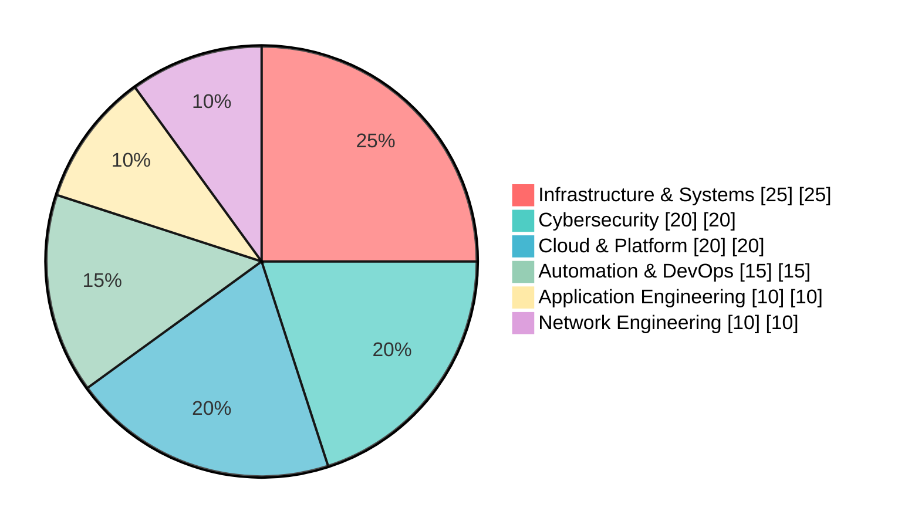

<table>
  <tr>
    <td>
      <h1>CALEB NGENO</h1>
      
      
<strong>Designing secure infrastructure and engineering platforms for modern operations.</strong>

    </td>
    <td align="right">
      
    </td>
  </tr>
</table>

---

## Profile

Engineering secure, resilient, and scalable technology platforms across infrastructure, cybersecurity, cloud, automation, and enterprise software.

My work combines systems engineering, security architecture, platform development, and operational automation to transform complex technology requirements into reliable, maintainable systems.

> **Engineering Philosophy:** *Secure by design. Automated by default. Observable in operation. Built to scale.*

---

## Core Capabilities

| **Infrastructure**              | **Cybersecurity**           | **Cloud & Platform**   | **DevOps & Automation**    |
| ------------------------------- | --------------------------- | ---------------------- | -------------------------- |
| Windows & Linux Environments    | Network Security & Defense  | Cloud Architecture     | Infrastructure Automation  |
| Active Directory & GPO          | Threat Detection & Analysis | Multi-Tenant Systems   | Bash, PowerShell, Python   |
| DNS / DHCP Administration       | Vulnerability Assessment    | SaaS Architecture      | CI/CD Deployment Workflows |
| Server & Network Infrastructure | IAM, RBAC & Monitoring      | REST APIs & Containers | Logging & Observability    |

---

## Skills Overview

---

# Selected Engineering Work

A curated selection of projects representing primary engineering focus across platform engineering, infrastructure automation, cybersecurity, networking, and security tooling.

### 01 — [iaas-platform](https://github.com/ogc16/iaas-platform) | Infrastructure-as-a-Service Platform

A Go-based infrastructure platform designed around multi-tenant organizations, resource management, programmable compute resources, and usage-aware infrastructure services.

* **Architecture:** Multi-Tenant Organizations, Resource Management, API Authentication, Rate Limiting
* **Platform Capabilities:** Compute Resources, Usage-Based Billing, REST APIs
* **Engineering Focus:** Platform Architecture, Cloud Infrastructure, Multi-Tenancy
* **Tech Stack:** Go, REST APIs, Cloud Architecture, SaaS

---

### 02 — [autorun](https://github.com/ogc16/autorun) | Centralized IT Automation Platform

A controlled automation platform for executing and scheduling operational workloads across IT environments with access control, auditing, and operational visibility.

* **Execution:** Bash, Python, PowerShell
* **Operations:** Job Scheduling, Live Execution Logs, Environment Automation
* **Governance:** RBAC, Audit Trails, Alerts
* **Tech Stack:** Java 17, Spring Boot, PowerShell, Python, Bash

---

### 03 — [nids](https://github.com/ogc16/nids) | Network Security Monitoring & Detection Platform

An open-source cybersecurity platform focused on network visibility, packet analysis, protocol inspection, and structured security operations workflows.

* **Capabilities:** Network Monitoring, Packet Analysis, Protocol Inspection
* **Security Operations:** Security Playbooks, Network Capture, Traffic Analysis
* **Tooling:** Wireshark, Tshark, Npcap
* **Tech Stack:** TypeScript, Wireshark, Tshark, Npcap, Network Security

---

### 04 — [cyber-shield-up](https://github.com/ogc16/cyber-shield-up) | AI-Assisted Security Tooling

A security-focused browser extension exploring automated vulnerability analysis and AI-assisted security assessment.

* **Capabilities:** Browser Security Analysis, Vulnerability Scanning, AI-Assisted Assessment
* **Engineering Focus:** Security Automation, Browser Security, AI-Assisted Analysis
* **Tech Stack:** TypeScript, Chrome Extensions, AI, Security

---

### 05 — [VPN](https://github.com/ogc16/VPN) | Secure Network Tunneling

A WireGuard-based networking project focused on secure tunneling, network forwarding, and protected connectivity.

* **Capabilities:** Tunnel Architecture, Network Forwarding, Secure Connectivity
* **Engineering Focus:** Network Infrastructure, Secure Routing, VPN Architecture
* **Tech Stack:** Kotlin, WireGuard, Networking

---

# Business & Enterprise Systems

Selected application platforms demonstrating the ability to translate operational and business requirements into production-oriented software systems.

| **Project**                                               | **Domain**                            | **Technology**  |
| --------------------------------------------------------- | ------------------------------------- | --------------- |
| [pbooks](https://github.com/ogc16/pbooks)                 | Construction Operations & Bookkeeping | TypeScript      |
| [booksy](https://github.com/ogc16/booksy)                 | Bookkeeping SaaS                      | TypeScript      |
| [aggregatorX](https://github.com/ogc16/aggregatorX)       | Data Aggregation                      | React / Node.js |
| [lms](https://github.com/ogc16/lms)                       | Learning Management                   | Python / Django |
| [swiftinvoice](https://github.com/ogc16/swiftinvoice)     | Invoicing                             | Swift           |
| [restaurant-pos](https://github.com/ogc16/restaurant-pos) | Point of Sale                         | C#              |

---

# Security Principles

| **Principle**        | **Approach**                                                                        |
| -------------------- | ----------------------------------------------------------------------------------- |
| **Secure by Design** | Security is incorporated into architecture from inception rather than added as an afterthought. |
| **Least Privilege**  | Access is restricted according to operational requirements, identity, and risk.                |
| **Defense in Depth** | Multiple independent security controls protect critical systems and data.           |
| **Automation**       | Repeatable operational processes are standardized and automated wherever practical. |
| **Observability**    | Systems provide meaningful telemetry and visibility for effective operations.       |
| **Auditability**     | Critical actions remain attributable, logged, and reviewable.                       |
| **Resilience**       | Systems are engineered to tolerate failures and recover predictably.                |

---

# Engineering Stack

**Infrastructure:** Linux, Windows Server, Active Directory, Group Policy, DNS, DHCP, Docker, Nginx

**Cloud & Platform:** AWS, Go, REST APIs, Multi-Tenancy, SaaS Architecture, Distributed Systems

**Security:** IAM, RBAC, Network Security, Wireshark, Tshark, Npcap, WireGuard

**Automation & Operations:** Python, Bash, PowerShell, Java, Spring Boot, CI/CD, Logging, Observability

**Application Engineering:** TypeScript, JavaScript, React, Next.js, Django, PostgreSQL, MongoDB, Supabase

---

# Experience

### TechGaetano — Security Operations

* Lead security operations and incident response, reducing cyberattack incidents by 40%
* Implemented advanced threat monitoring and response strategies, improving detection by 30%
* Conducted vulnerability assessments and penetration testing to identify weaknesses
* Collaborated with cross-functional teams to develop security protocols and improve network safety
* Provided training to internal staff on cybersecurity best practices and policies
* Monitored and analyzed network traffic to identify security threats
* Developed incident response plans and contributed to disaster recovery operations
* Performed security audits and ensured compliance with industry standards

---

# Skills

**Network Security & Risk Management** • **Penetration Testing & Vulnerability Assessments** • **Incident Response & Disaster Recovery** • **Threat Monitoring & Intrusion Detection** • **SIEM** • **Firewall Management & VPNs** • **Compliance (GDPR, HIPAA, PCI-DSS)** • **Python, Bash, PowerShell**

---

# Certifications & Education

### Certifications

* Google Cybersecurity Professional Certificate
* Cisco Junior Cybersecurity Analyst
* Cisco Ethical Hacker
* CompTIA Security+ — In Progress

### Education

**Bachelor of Science in Information Technology**

*Jomo Kenyatta University of Agriculture and Technology (JKUAT)*

Focus Areas: Systems Security • Software Development • Data Structures • Information Technology

---

# Current Focus

* **Platform Engineering** — Infrastructure platforms, multi-tenant architecture, cloud systems, distributed services, and programmable infrastructure
* **Cybersecurity** — Network defense, security operations, detection engineering, security tooling, and security automation
* **Operational Engineering** — IT automation, observability, infrastructure tooling, controlled execution, and operational resilience
* **Emerging Systems** — AI-assisted security, intelligent automation, and next-generation infrastructure platforms

---

# Engineering Perspective

> **Technology should reduce risk, increase operational leverage, and create durable capabilities.**

I build systems with a long-term engineering perspective:

**Secure by design.**
**Automated by default.**
**Observable in operation.**
**Structured to scale.**

---

# Contact

For professional engagements, technology consulting, infrastructure engineering, cybersecurity, platform engineering, and software development:

**Portfolio:** [Tech Gaetano](https://techgaetano.com)
**GitHub:** [github.com/ogc16](https://github.com/ogc16)
**Email:** [softwarecaleb@gmail.com](mailto:softwarecaleb@gmail.com)

---

**SECURE INFRASTRUCTURE • AUTOMATED OPERATIONS • RESILIENT PLATFORMS**

[Portfolio](https://techgaetano.com) · [GitHub](https://github.com/ogc16) · [Email](mailto:softwarecaleb@gmail.com)

